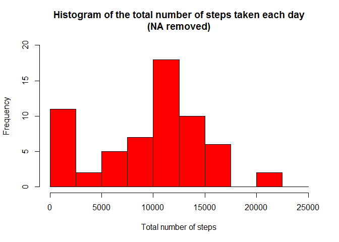
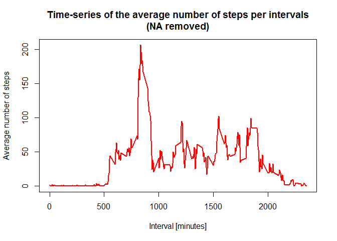
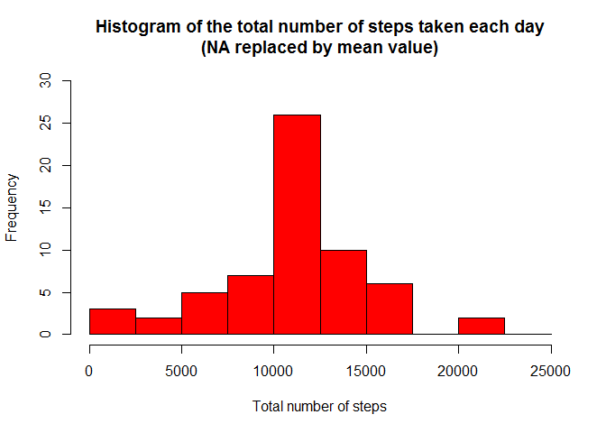

# Reproducible Research: Peer Assessment 1


## Loading and preprocessing the data

```r
# Transform the date attribute to an actual date format
# Load the raw activity data
setwd('D:/Documents/Graduate\ Report/Coursera/ReproducibleResearch/homework1')

activity_raw <- read.csv("activity.csv", stringsAsFactors=FALSE)
activity_raw$date <- as.POSIXct(activity_raw$date, format="%Y-%m-%d")

# Compute the weekdays from the date attribute
activity_raw <- data.frame(date=activity_raw$date, 
                           weekday=tolower(weekdays(activity_raw$date)), 
                           steps=activity_raw$steps, 
                           interval=activity_raw$interval)


# Compute the weekdays from the date attribute
activity_raw <- data.frame(date=activity_raw$date, 
                           weekday=tolower(weekdays(activity_raw$date)), 
                           steps=activity_raw$steps, 
                           interval=activity_raw$interval)

# Compute the day type (weekend or weekday)
activity_raw <- cbind(activity_raw, 
                      daytype=ifelse(activity_raw$weekday == "saturday" | 
                                       activity_raw$weekday == "sunday", "weekend", 
                                     "weekday"))

# Create the final data.frame
activity <- data.frame(date=activity_raw$date, 
                       weekday=activity_raw$weekday, 
                       daytype=activity_raw$daytype, 
                       interval=activity_raw$interval,
                       steps=activity_raw$steps)

# Clear the workspace
rm(activity_raw)
```
## What is mean total number of steps taken per day?

```r
#transform data and rename sum_step
sum_step=aggregate(activity$step,by =list(activity$date),FUN=sum, na.rm=TRUE)
names(sum_step)=c("date",'total')

#plot histogram
hist(sum_step$total, 
     breaks=seq(from=0, to=25000, by=2500),
     col="red", 
     xlab="Total number of steps", 
     ylim=c(0, 20), 
     main="Histogram of the total number of steps taken each day\n(NA removed)")
```

 

```r
#report mean and median
mean_1=mean(sum_step$total)
median_1=median(sum_step$total)
```
The mean total number of steps taken per day is 9354.
The median total number of steps taken per day is 1.0395\times 10^{4}.


## What is the average daily activity pattern?

```r
rm(sum_step)
mean_step=aggregate(activity$step,by =list(activity$interval),FUN=mean, na.rm=TRUE)
names(mean_step)=c("interval",'mean')

# Compute the time series plot
plot(mean_step$interval, 
     mean_step$mean, 
     type="l", 
     col="red", 
     lwd=2, 
     xlab="Interval [minutes]", 
     ylab="Average number of steps", 
     main="Time-series of the average number of steps per intervals\n(NA removed)")
```

 

```r
#find the index of the maximum mean and the interval
max_pos <- which(mean_step$mean == max(mean_step$mean))
max_interval <- mean_step[max_pos, 1]
# Clear the workspace
rm(max_pos, mean_step)
```
## Imputing missing values

```r
NA_total=sum(is.na(activity$step))


# Clear the workspace
rm(NA_total)

# Find the NA positions
na_pos <- which(is.na(activity$steps))

# Create a vector of means
mean_vec <- rep(mean(activity$steps, na.rm=TRUE), times=length(na_pos))


# Replace the NAs by the means
activity[na_pos, "steps"] <- mean_vec

# Clear the workspace
rm(mean_vec, na_pos)

# Compute the total number of steps each day (NA values removed)
sum_data <- aggregate(activity$steps, by=list(activity$date), FUN=sum)

# Rename the attributes
names(sum_data) <- c("date", "total")

# Compute the histogram of the total number of steps each day
hist(sum_data$total, 
     breaks=seq(from=0, to=25000, by=2500),
     col="red", 
     xlab="Total number of steps", 
     ylim=c(0, 30), 
     main="Histogram of the total number of steps taken each day\n(NA replaced by mean value)")
```

 

```r
mean2=mean(sum_data$total,na.rm = TRUE)
median2=median(sum_data$total,na.rm = TRUE)
```
After filling the missing values, the mean is 1.0766\times 10^{4}, and the median is 1.0766\times 10^{4}. They are different from the original results.

## Are there differences in activity patterns between weekdays and weekends?


```r
library(lattice)

# Compute the average number of steps taken, averaged across all daytype variable
mean_data <- aggregate(activity$steps, 
                       by=list(activity$daytype, 
                               activity$weekday, activity$interval), FUN=mean, na.rm=TRUE)

# Rename the attributes
names(mean_data) <- c("daytype", "weekday", "interval", "mean")


# Compute the time serie plot
xyplot(mean_data$mean ~ mean_data$interval | daytype, mean_data, 
       type="l", 
       lwd=1, 
       xlab="Interval", 
       ylab="Number of steps", 
       layout=c(1,2))
```

 

The patterns look different for the weekend and the weekday.
